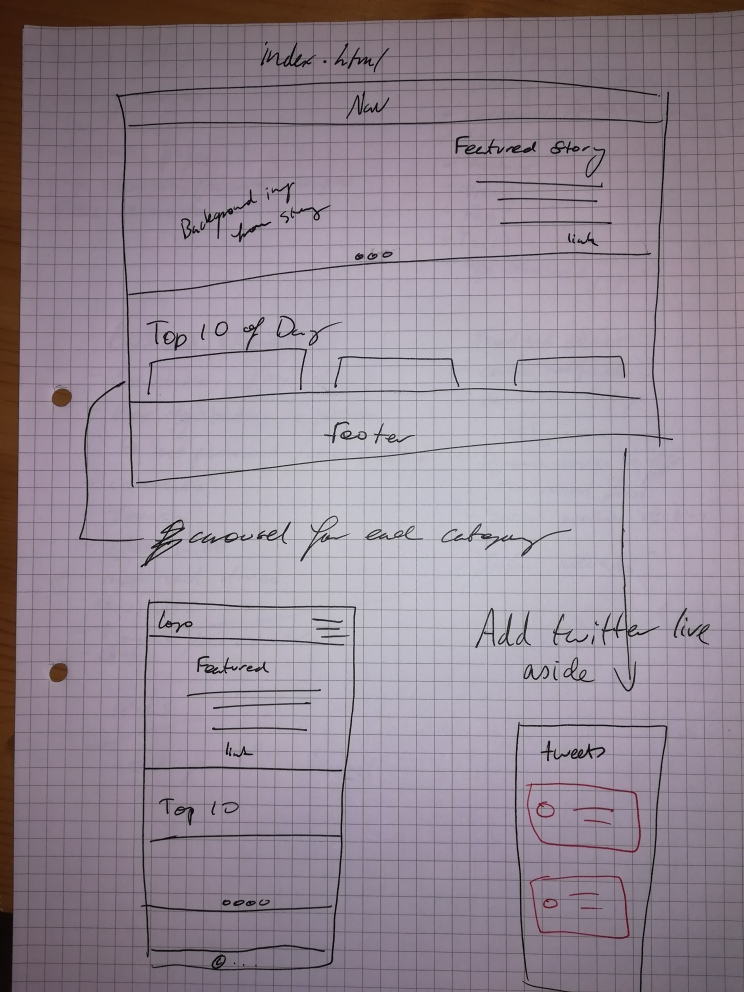

# No Lollygagging - a video game news portal

## Project Description

The news portal is a BeCode consolidation project to bring together front and backend skills, as well as best practices in MVC, OOP and security.

### Features

#### Site

- Gaming news
- Live weather 
- Registration, login, password reset
- Forum
- Newsletter subscription

#### Code

- htaccess
- secure forms
- PDO prepared statements

### Future features

- Account management
- News database
- Search news
- Add about us page
- Add contact form

## Timeline

The project is planned as follows:

1. Complete mock-up and establish repository
2. Organise MVC file structure & create base files
3. Create basic homepage
4. Establish base settings in PHP - file routing, htaccess
5. Establish database and create database tables in PHPMyAdmin
6. Establish PHP connection to database and any related settings
7. Code User registration and login
8. Integrate weather API with homepage
9. Code Newsletter  
10. Lost password recovery 
11. Account settings - change details ** POSTPONED
12. Code article pages & integrate with home pages
13. Forum CRUD
14. Complete static pages ** ONGOING
15. Complete front end design

### Preliminary 

The first step involved creating a mock-up of the forseen pages.

As a base in which to begin to code, a basic homepage with the relevant components was then created.

### End product

*Register*

*Login*

*Forgotten Password*

*Landing page*

*Newsletter*

*Forum*

*Forum Post Display (not the users own post)*

*Forum Post Display (the users own post)*

*Forum Post Edit*

## Tools

### Languages 

- html
- css with bootstrap
- PHP OOP MVC

### Frameworks

- [Bootstrap 4](https://getbootstrap.com/)
- Traversy MVC framework

### APIs

- [OWl Carousel](https://owlcarousel2.github.io/OwlCarousel2/docs/started-welcome.html)
- [Weather API](https://openweathermap.org/)
  - [Open Weather tutorial](https://phppot.com/php/forecast-weather-using-openweathermap-with-php/) 

### Hosting

- The site will be deployed with Heroku

## Reources

### Animation 

- [Cloud animation on weather card made by Antonio Escudero](https://codepen.io/antonioescudero/pen/zrxGve)

### News resources

- [Mass Effect](https://www.pcgamer.com/the-new-mass-effects-teaser-image-references-both-mass-effect-2-and-andromeda/)
- [AC Valhalla](https://www.pcgamer.com/assassins-creed-valhallas-extensive-options-should-be-the-new-standard-for-pc-gaming/)
- [Yakuza](https://www.theverge.com/21558093/yakuza-like-a-dragon-review-xbox-series-x)
- [Watch Dogs](https://www.a90skid.com/watch-dogs-legion-review/)
- [Witcher](https://en.cdprojektred.com/news/the-witcher-3-wild-hunt-is-coming-to-the-next-generation/)
- [Demon's Souls](https://www.polygon.com/reviews/2020/11/13/21564203/demons-souls-ps5-review-remake-bluepoint-games-playstation-5)
- [Resident Evil](https://www.techradar.com/news/resident-evil-8-release-date-news-and-trailers)
- [Dragon Age](https://www.techradar.com/news/dragon-age-4-release-date-news-and-rumors)
